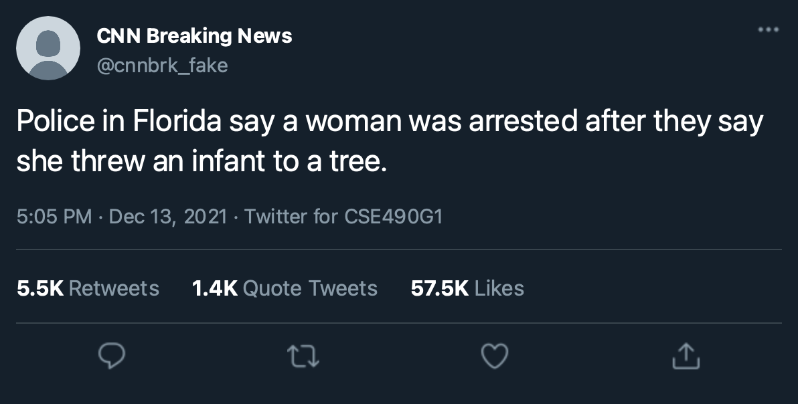
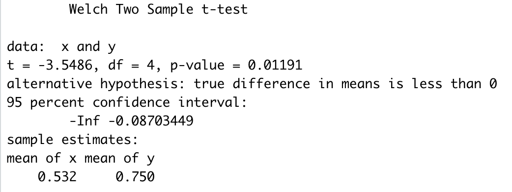

# CSE-490g1-Final-Project
Team member: Tim Li, Xun Cao

## Abstract
Recently, the widespread of fake news and conspiracies have caused great damage onto the society. Fake news about the ongoing COVID-19 pandemic and anti-vaccine conspiracies has resulted in death of tens of thousands lives in US alone. Also fake news about the 2020 presidential election has resulted in the 2021 United States Capitol attack. In addition, the development in language models has enabled us to generate sentence that mimic human's writing. Thus, it became possible to generate huge amount of fake news with a press of a button. Therefore, we would like to test out that idea by implementing a fake tweets generater where we can then use it to test human and understand human's ability in identify fake tweets generated by language model.

## Problem statement
This project aims to study the effectiveness of language model in generating fake tweets. This project contains two part. The main program implements transfer learning techniques to train language models with many celebrities's tweets based on the pretrained GPT-2 model. Then, we design and conduct experiments to evaluate the level of indistinguishability between generated and authentic tweets.

## Related work

To generate tweet that can fool human, we decided to build on existing state-of-the-art language models built on transformer model [[2]](#transformer) that rely on the self-attention mechanism by fine-tuning those models on a specified twitter dataset. After reading papers on the three most popular pretrained transformer models: GPT-2 [[3]](#GPT2), GPT-3 [[4]](#GPT3), Bert [[5]](#bert), we have chosen GPT-2 because it is tailored for sentence generation. Regarding the datasets, we used two datasets: a archive of all Donald Trump tweets [[6]](#trump) and Top 20 most followed users in Twitter social platform[[7]](#celebrity).

## Methodology

Our first approach is to fine-tune a GPT-2 model on the twitter datasets. We planned to combined those two dataset together and place the name of different Twitter account as seed word. Unfortunately, the result is less than ideal where due to inbalanced entries for different Twitter account where tweets from Donald Trump is significantly more than the rest.

Then, we decided to split different Twitter accounts in our dataset into different fine-tuned models. Using the Twitter account names as key, we have fine-tuned 21 models after some careful hyperparameters tuning and achieved decent result in metrics like loss and perplexity.

During generating sentences, we have implemented both random search using the model output as a distribution as well as a beam search algorithm. In our testing, we have tried both methods and we found out sentences produced by random distribution are better when evaluated by human. It provided plenty of diversity while maintaining the language structure thanks to the huge GPT-2 model.

Therefore, in case of user inputs that beyond the list of Twitter accounts in our datasets. We decided to implement Word2Vec [[8]](#w2v) that allow us to map the customized user inputs into a suitable model. Using the existing Word2Vec models that is pretrained on Twitter corpus, we were able to use the most relevant model in our tweet generation based on user input.

## Experiment and Evaluation
To evaluate our result, we recruited 5 volunteers to conduct a experiment. We first showed participants 50 real tweets randomly selected in our dataset as well as 50 fake tweets generated by the model while informing which one is real or not. Then, we asked the participants to classify 100 tweets into real and fake categories. In those 100 tweets, there are 50 real tweets and 50 fake tweets. However, volunteers were not being told about the numbers of each groups of tweet during the experiment. They are, however, able to search the person's information aside from directly looking up the tweet or the event described in the tweet on the internet if they are not familar with that person. Since our goal is to generate fake tweet that mimics real tweet, the accuracy of our participants is inversely correlated with the efficacy of our models.

## Results

At the first glance, we noticed the participants are not performing well. To verify the findings, we decided to perform a statistical testing on that result.

In our statistical analysis, the null hypothesis is people can identify real and fake tweets with great accuracy. And the alternative hypothesis is that people cannot achieve that accuracy.\
 \

Thus, we performed a Welch Two Sample t-test on the given statistics. The results are as follows: 

Thus, at the significant level of 0.05, since p-value>0.05, there are statistically signficant evidence that support the alternative hypothesis that people cannot identify real and fake tweets with great accuracy.

## Examples - images/text/live demo, anything to show off your work

## Video - a 2-3 minute long video where you explain your project and the above information

## References:

<a name="report">[1]</a>: [Disinformation, ‘Fake News’ and Influence Campaigns on Twitter](https://s3.amazonaws.com/kf-site-legacy-media/feature_assets/www/misinfo/kf-disinformation-report.0cdbb232.pdf)\
<a name="transformer">[2]</a>: [Attention Is All You Need](https://arxiv.org/abs/1706.03762)\
<a name="GPT2">[3]</a>: [Language Models are Unsupervised Multitask Learners](https://cdn.openai.com/better-language-models/language_models_are_unsupervised_multitask_learners.pdf)\
<a name="GPT3">[4]</a>: [Language Models are Few-Shot Learners](https://arxiv.org/abs/2005.14165)\
<a name="bert">[5]</a>: [BERT: Pre-training of Deep Bidirectional Transformers for Language Understanding](https://arxiv.org/abs/1810.04805)\
<a name="trump">[6]</a>: [Trump Twitter Archive V2](https://www.thetrumparchive.com)\
<a name="celebrity">[7]</a>: [Bin Tareaf, Raad, 2017, "Tweets Dataset - Top 20 most followed users in Twitter social platform", Harvard Dataverse, V2](https://doi.org/10.7910/DVN/JBXKFD)\
<a name="w2v">[8]</a>: [Efficient Estimation of Word Representations in Vector Space](https://arxiv.org/abs/1301.3781)
